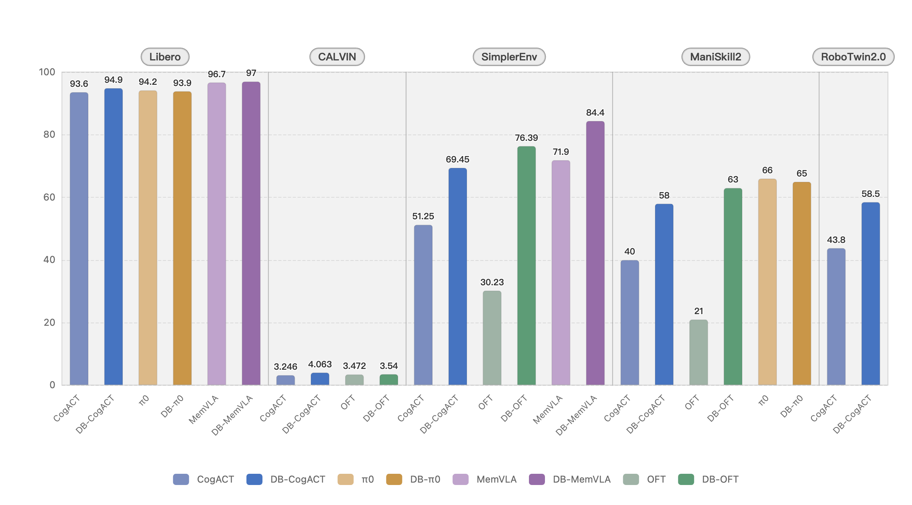

<div align="center">
  

  # 一站式具身智能 VLA 开发工具箱

  [](https://arxiv.org/pdf/2510.23511)
  [](https://huggingface.co/Dexmal)
  [](https://dexbotic.com/docs/)
  [](LICENSE)

  <p align="center">
    <strong>预训练 · 微调 · 推理 · 评测</strong><br>
    支持 π0、CogACT、OFT、MemVLA 等主流策略
  </p>
</div>

## 简介

**Dexbotic** 是一套基于 PyTorch 框架开发的 VLA（视觉-语言-动作）开发工具箱，旨在为具身智能研究提供一个统一、高效的。它内置了多种主流 VLA 模型的环境配置，用户只需简单的设置即可复现、微调和推理各种前沿算法。

- **开箱即用的 VLA 框架**：以 VLA 模型为核心，集成了具身操作和导航功能，支持多种业内领先的算法。
- **高性能预训练基础模型**：针对 π0 和 CogACT 等主流 VLA 算法，提供了多个基于 Dexbotic 优化后的预训练模型。
- **模块化开发架构**：采用「分层配置 + 工厂注册 + 入口分发」架构，用户仅需修改实验脚本，即可轻松实现配置修改、模型更换或任务添加等需求。
- **云端与本地一体化训练**：全面支持云端与本地训练需求，支持阿里云、火山引擎等云训练平台，同时适配消费级 GPU 进行本地训练。
- **广泛的机器人适配**：针对 UR5、Franka 和 ALOHA 等主流机器人，提供了**统一的训练数据格式**和部署脚本。


## 🔥 最新动态

- **[2026-01-08]** 🆕 新增 **联合训练 (Co-training)** 能力，支持对 CogACT 模型的动作专家和 LLM 进行联合优化。同时发布适配 **Blackwell GPU** 的专用镜像。
- **[2025-12-29]** 全面支持 **OFT** 和 **Pi0.5** 模型。
- **[2025-10-20]** Dexbotic 正式发布！详情请查阅 [技术报告](https://arxiv.org/pdf/2510.23511) 和 [官方文档](https://dexbotic.com/docs/)。


## 快速开始

我们强烈推荐使用 Docker 进行开发或部署，以获得最佳的使用体验。

### 1. 安装与环境配置

```bash
# 1. 克隆代码仓库
git clone https://github.com/dexmal/dexbotic.git

# 2. 启动 Docker 容器
docker run -it --rm --gpus all --network host \
  -v $(pwd)/dexbotic:/dexbotic \
  dexmal/dexbotic \
  bash

# 3. 激活环境并安装依赖
cd /dexbotic
conda activate dexbotic
pip install -e .
```
> **系统要求**：Ubuntu 20.04/22.04，推荐使用 RTX 4090、A100 或 H100（训练建议 8 GPU，部署需 1 GPU）。

<details>
<summary>在 Blackwell GPU 上使用</summary>

对于使用 Blackwell 架构 GPU（例如 B100、RTX 5090）的用户，请使用专用的 Docker 镜像 `dexmal/dexbotic:c130t28`。

```bash
# 1. 使用 Blackwell 镜像启动 Docker
docker run -it --rm --gpus all --network host \
  -v /path/to/dexbotic:/dexbotic \
  dexmal/dexbotic:c130t28 \
  bash

# 2. 激活环境**
cd /dexbotic
pip install -e .
```

</details>

### 2. 使用指南

- [运行预训练模型](https://dexbotic.com/docs/2.%20Get%20Start.html#_2-run-a-pretrained-model)
- [基于仿真数据训练](https://dexbotic.com/docs/2.%20Get%20Start.html#_3-train-on-provided-simulator-data)
- [测试与评估](https://dexbotic.com/docs/2.%20Get%20Start.html#_4-test-your-trained-model)
- [完整的官方文档](https://dexbotic.com/docs/)


## 基准测试

以下展示了基于 Dexbotic 训练的模型与原始模型在主流仿真环境下的评测结果对比。



📊 **查看更多详细评测结果**: [Simulation Results](https://dexbotic.com/docs/7.%20Simulation%20Results.html)

<table style="width: 100%; table-layout: fixed; border-collapse: collapse;"> <thead align="center" style="background-color: #f6f8fa;"> <tr> <th style="padding: 10px; border: 1px solid #dfe2e5;">Libero</th> <th style="padding: 10px; border: 1px solid #dfe2e5;">CALVIN</th> <th style="padding: 10px; border: 1px solid #dfe2e5;">SimplerEnv</th> <th style="padding: 10px; border: 1px solid #dfe2e5;">ManiSkill2</th> <th style="padding: 10px; border: 1px solid #dfe2e5;">RoboTwin2.0</th> </tr> </thead> <tbody valign="top"> <tr> <td style="padding: 10px; border: 1px solid #dfe2e5;"> <ul style="margin-left: 0; padding-left: 20px; margin-top: 0;"> <li>CogACT: 93.6</li> <li>DB-CogACT: 94.9</li> <li>π0: 94.2</li> <li>DB-π0: 93.9</li> <li>MemVLA: 96.7</li> <li><b>DB-MemVLA: 97.0</b></li> </ul> </td> <td style="padding: 10px; border: 1px solid #dfe2e5;"> <ul style="margin-left: 0; padding-left: 20px; margin-top: 0;"> <li>CogACT: 3.246</li> <li><b>DB-CogACT: 4.063</b></li> <li>OFT: 3.472</li> <li>DB-OFT: 3.540</li> </ul> </td> <td style="padding: 10px; border: 1px solid #dfe2e5;"> <ul style="margin-left: 0; padding-left: 20px; margin-top: 0;"> <li>CogACT: 51.25</li> <li>DB-CogACT: 69.45</li> <li>OFT: 30.23</li> <li>DB-OFT: 76.39</li> <li>MemVLA: 71.9</li> <li><b>DB-MemVLA: 84.4</b></li> </ul> </td> <td style="padding: 10px; border: 1px solid #dfe2e5;"> <ul style="margin-left: 0; padding-left: 20px; margin-top: 0;"> <li>CogACT: 40</li> <li>DB-CogACT: 58</li> <li>OFT: 21</li> <li>DB-OFT: 63</li> <li><b>π0: 66</b></li> <li>DB-π0: 65</li> </ul> </td> <td style="padding: 10px; border: 1px solid #dfe2e5;"> <ul style="margin-left: 0; padding-left: 20px; margin-top: 0;"> <li>CogACT: 43.8</li> <li><b>DB-CogACT: 58.5</b></li> </ul> </td> </tr> </tbody> </table>

## 未来计划

我们正在积极开发以下新功能，敬请期待：

- 预训练模型：Dexbotic-OFT
- 导航策略：NaVid、NaVILA、StreamVLN

## 支持我们

我们正在不断改进，更多功能即将推出。如果你喜欢这个项目，请在 GitHub 上给我们点一颗星 [](https://github.com/dexmal/dexbotic)，你的支持是我们前进的动力！

如果 Dexbotic 对你的研究工作有所帮助，请考虑引用我们的技术报告：

```bibtex
@article{dexbotic,
  title={Dexbotic: Open-Source Vision-Language-Action Toolbox},
  author={Dexbotic Contributors},
  journal={arXiv preprint arXiv:2510.23511},
  year={2025}
}
```

## 许可

本项目采用 [MIT 许可证](LICENSE)。
